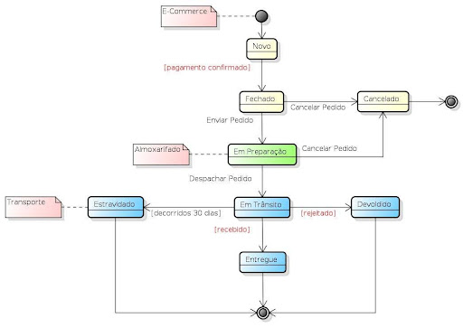
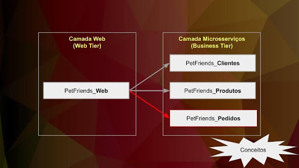
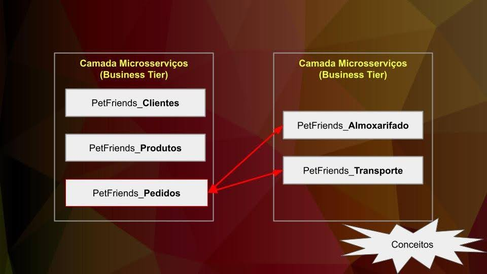

# Exercícios - Microsserviços, DDD e Event-Driven

## Diagramas de referência

### Diagrama 1 – Estados do agregado Pedido

### Diagrama 2 – Camada Web → Microsserviço Pedidos

### Diagrama 3 – Microsserviço Pedidos → Almoxarifado e Transporte

---

## Parte 2 – Exercícios

### Transformar monólitos em microsserviços eficazes, aplicando princípios de DDD e técnicas de decomposição

1. Implemente a classe entity e seu respectivo repository que represente o agregado mais representativo do microsserviço **PetFriends_Almoxarifado**.

2. Implemente um exemplo de **Value Object** a ser usado na classe entity da questão anterior.

3. Implemente a classe entity e seu respectivo repository que represente o agregado mais representativo do microsserviço **PetFriends_Transporte**.

4. Implemente um exemplo de **Value Object** a ser usado na classe entity da questão anterior.

### Projetar softwares usando *Domain Events*

5. O módulo **PetFriends_Web** foi desenvolvido em ReactJS, acessando os microsserviços de Clientes, Produtos e Pedidos de forma síncrona, via REST API. Que funcionalidade síncrona executada pelo cliente é diretamente afetada pelos eventos de domínio?

6. Explique, de forma sucinta, qual é a diferença entre enviar eventos somente com o **ID do agregado** e enviar um **payload completo**.

7. A partir da resposta dada na questão anterior, como você projetaria o evento a ser enviado pelo **PetFriends_Pedido** para o **PetFriends_Almoxarifado**?

8. A partir da resposta dada na questão anterior, como você projetaria o evento a ser enviado pelo **PetFriends_Pedido** para o **PetFriends_Transporte**?

### Desenvolver microsserviços *event-driven* e com outros padrões de comunicação assíncrona

9. No microsserviço **PetFriends_Almoxarifado**, implemente a classe de configuração para o tratamento de mensagens para receber os eventos do **PetFriends_Pedidos**.

10. No microsserviço **PetFriends_Almoxarifado**, implemente o serviço que receberá os eventos do **PetFriends_Pedidos**.

11. No microsserviço **PetFriends_Transporte**, implemente a classe de configuração para o tratamento de mensagens para receber os eventos do **PetFriends_Pedidos**.

12. No microsserviço **PetFriends_Transporte**, implemente o serviço que receberá os eventos do **PetFriends_Pedidos**.

### Implementar testes e observabilidade em microsserviços com Zipkin, Micrometer e ELK Stack

13. Explique, de forma sucinta, o que é um **Gateway de Serviço**, suas vantagens e desvantagens.

14. O que é **ID de Correlação** e quais são os seus pré-requisitos?

15. Qual é a função do **Micrometer** e sua relação com o serviço **Zipkin**?

16. Explique, de forma sucinta, o que é um **Agregador de Logs**, suas vantagens e desvantagens.
